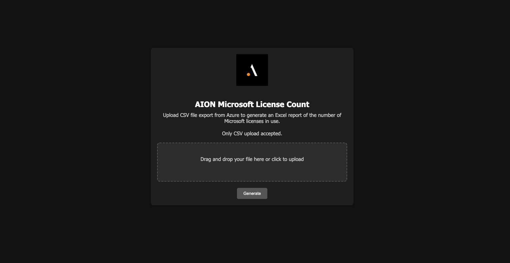

# AION Microsoft License Report

AION Microsoft License Counter is a web application that allows users to upload a CSV file exported from Azure to generate a report of the number of Microsoft licenses in use.

## Features

- Drag-and-drop file upload or click to upload
- Validation of CSV file type
- Summary report of Microsoft licenses
- Hosted on a local network

## Requirements

- Python 3.6 or higher
- Flask
- pandas
- numpy
- xlsxwriter
- gunicorn

## Installation

1. **Clone the repository:**

    ```sh
    git clone https://github.com/bkh5433/AIONLicenseScraper.git
    cd AIONLicenseScraper
    ```

2. **Create a virtual environment and activate it:**

    ```sh
    python -m venv venv
    source venv/bin/activate  # On Windows use `venv\Scripts\activate`
    ```

3. **Install the required packages:**

    ```sh
    pip install -r requirements.txt
    ```

## Configuration


1. **Make the `run_gunicorn.sh` script executable:**

    ```sh
    chmod +x run_gunicorn.txt
    ```

## Usage

1. **Run the application with Gunicorn:**

    ```sh
    ./run_gunicorn.txt
    ```

2. **Access the application:**

    - If using Gunicorn directly, open a web browser and navigate to `http://your_server_ip:8000`
    

