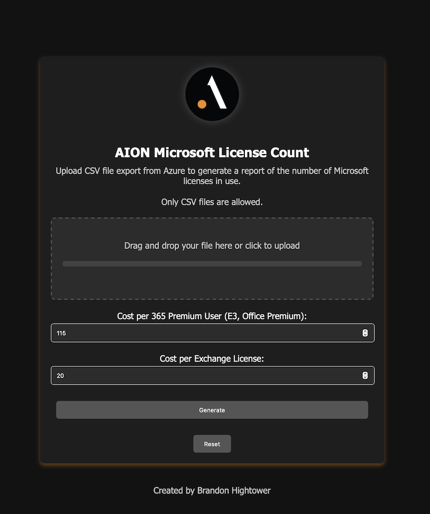

# AION Microsoft License Report

AION Microsoft License Counter is a web application that allows users to upload a CSV file exported from Azure to generate a report of the number of Microsoft licenses in use.

## Table of Contents

- [Features](#features)
- [Prerequisites](#prerequisites)
- [Installation](#installation)
   - [Environment Variables](#environment-variables)
- [Deployment](#deployment)
   - [Using Docker Compose](#using-docker-compose)
   - [Using the Build and Run Script](#using-the-build-and-run-script)
   - [Customizing Nginx Configuration](#customizing-nginx-configuration)
- [Usage](#usage)
- [Contributing](#contributing)
- [License](#license)

## Features

- **CSV Upload**: Easily upload CSV files exported from Azure.
- **Report Generation**: Generate detailed reports on Microsoft licenses in use.
- **Secure Deployment**: Utilize Docker and Nginx for secure and scalable deployments.
- **Admin Center**: Monitor metrics and manage the application through the admin interface.
- **Error Handling**: Comprehensive error pages with animations for better user experience.

## Prerequisites

Before you begin, ensure you have met the following requirements:

- **Docker**: Ensure Docker is installed on your machine. You can download it
  from [here](https://www.docker.com/get-started).
- **Docker Compose**: Make sure Docker Compose is installed. Installation instructions can be
  found [here](https://docs.docker.com/compose/install/).
- **Git**: Git should be installed to clone the repository. Download it from [here](https://git-scm.com/downloads).
- **OpenSSL**: Required for generating secret keys. Install it via your package manager if not already available.

## Installation

1. **Clone the Repository**

   ```bash
   git clone https://github.com/yourusername/aion-license-counter.git
   cd aion-license-counter
   ```

2. **Environment Variables**

   The `build_and_run.sh` script automatically generates and manages environment variables:

   - `VERSION`: Determined from git tags (e.g., "1.0.0-dirty")
   - `BRANCH`: Current git branch
   - `BUILD_DATE`: Current date and time in EST
   - `BUILD`: Build number in format YYYYMMDD.increment
   - `DEPLOY_ENV`: Deployment environment (defaults to "dev")
   - `FLASK_SECRET_KEY`: Randomly generated secret key

   These variables are:

   - Exported as environment variables
   - Saved to `version.json`
   - Passed to Docker during build

   No manual `.env` file creation is required, but you can override `DEPLOY_ENV` by setting it before running the
   script:

   ```bash
   export DEPLOY_ENV=production
   ./build_and_run.sh
   ```

## Deployment

You can deploy the AION Microsoft License Counter application using Docker Compose or the provided build and run script.

### Using Docker Compose

1. **Build and Start the Containers**

   Use the following command to build the Docker images and start the containers:

   ```bash
   docker-compose up --build -d
   ```

   This command performs the following:

   - Builds the Docker images based on the `Dockerfile` and `Dockerfile.nginx`.
   - Starts the `web` and `nginx` services in detached mode.

2. **Access the Application**

   Once the containers are running, navigate to `http://localhost` in your web browser to access the application.

3. **Managing Containers**

   - **Stop Containers**

     ```bash
     docker-compose down
     ```

   - **View Logs**

     ```bash
     docker-compose logs -f
     ```

### Using the Build and Run Script

The `build_and_run.sh` script automates the build and deployment process. It handles versioning, builds the Docker
images, and starts the containers.

1. **Make the Script Executable**

   ```bash
   chmod +x build_and_run.sh
   ```

2. **Run the Script**

   ```bash
   ./build_and_run.sh
   ```

   **Optional Flags:**

   - `--rebuild`: Force rebuild of Docker images.
   - `--prune`: Prune dangling Docker images before building.

   **Example with Flags:**

   ```bash
   ./build_and_run.sh --rebuild --prune
   ```

3. **What the Script Does**

   - **Generates Build Information**: Creates or updates the `version.json` file with build details.
   - **Manages Environment Variables**: Automatically generates environment variables and exports them.
   - **Manages Docker Containers**: Stops and removes existing containers if they are running.
   - **Prunes Docker Images**: Removes dangling images to free up space (optional).
   - **Builds Docker Images**: Rebuilds the images without using the cache (optional).
   - **Starts Containers**: Launches the services defined in `docker-compose.yml`.

4. **Environment Variable Management**

   The `build_and_run.sh` script handles the creation and management of environment variables automatically. It performs
   the following:

   - **Generates a Secret Key**: Uses OpenSSL to generate a random secret key.
   - **Creates `version.json`**: Stores build details such as version, branch, build date, build number, environment,
     and secret key.
   - **Passes Variables to Docker**: These variables are exported and used during the Docker build process.

   **Note:** If you wish to override the deployment environment, set the `DEPLOY_ENV` variable before running the
   script:

   ```bash
   export DEPLOY_ENV=production
   ./build_and_run.sh
   ```

5. **Access the Application**

   After running the script, access the application at `http://localhost`.

### Customizing Nginx Configuration

Depending on your deployment environment, you might need to customize the Nginx configuration to suit your specific
requirements. Common adjustments include:

- **Server Name**: Update the `server_name` in `nginx.conf` to match your domain or server IP.

  ```nginx
  server {
      listen 80;
      server_name yourdomain.com;

      # Redirect all HTTP requests to HTTPS
      return 301 https://$server_name$request_uri;
  }

  server {
      listen 443 ssl;
      server_name yourdomain.com;

      # SSL certificate configuration
      ssl_certificate /etc/nginx/ssl/yourdomain.crt;
      ssl_certificate_key /etc/nginx/ssl/yourdomain.key;

      # ... rest of the configuration
  }
  ```

- **SSL Certificates**: Replace the self-signed certificates with your official SSL certificates for production
  environments.

   - Place your `.crt` and `.key` files in the `ssl/` directory.
   - Update the `ssl_certificate` and `ssl_certificate_key` paths in `nginx.conf` accordingly.

- **Proxy Settings**: If your Flask application runs on a different port or requires additional proxy headers, update
  the `location /` block in `nginx.conf`.

- **Static Files**: Ensure that the paths for static and upload directories in the `alias` directives match your
  application's structure.

After making changes to `nginx.conf`, rebuild and restart the Nginx container to apply the new configuration:

```bash
docker-compose build nginx
docker-compose up -d nginx
```

## Usage

1. **Upload CSV File**

   - Navigate to the application's upload page.
   - Drag and drop your CSV file exported from Azure or click to select the file.
   - Enter the **Cost per 365 Premium User** and **Cost per Exchange License**.
   - Click **Generate** to create the license report.

2. **View Summary**

   After processing, you'll be redirected to the summary page where you can:

   - View detailed charts and metrics.
   - Download the full report.
   - Reset metrics if necessary.

3. **Admin Center**

   - Access the admin center at `http://localhost/admin`.
   - Monitor unique users, reports generated, and view application logs.
   - Reset metrics or filter logs as needed.

## Contributing

Contributions are welcome! Please fork the repository and create a pull request with your changes.

1. **Fork the Repository**

2. **Create a Feature Branch**

   ```bash
   git checkout -b feature/YourFeature
   ```

3. **Commit Your Changes**

   ```bash
   git commit -m "Add Your Feature"
   ```

4. **Push to the Branch**

   ```bash
   git push origin feature/YourFeature
   ```

5. **Create a Pull Request**

## License

This project is licensed under the [MIT License](LICENSE).


    

